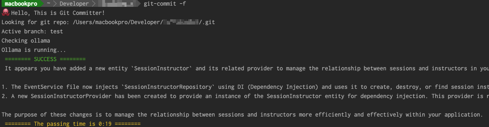

# Git Committer




Git Committer is a command-line tool that assists in generating commit messages for your Git repository using the Ollama API. It checks the current state of your Git repository, identifies changes, and uses the `mistral` model from the Ollama API to suggest appropriate commit messages.

## Features

- Checks if the current directory is a valid Git repository.
- Identifies the active branch of the repository.
- Connects to the Ollama API to ensure it's running.
- Generates Git commit messages based on the differences in code.
- Supports a fast mode for generating basic commit messages quickly.

## Requirements

- Python 3.x
- `gitpython` library
- `requests` library
- `click` library
- Ollama API running locally on `http://localhost:11434`

## Installation

1. Clone the repository:

    ```bash
    git clone https://github.com/yourusername/git-committer.git
    cd git-committer
    ```

2. Install the required Python packages:

    ```bash
    pip install gitpython requests click
    ```

3. Ensure the Ollama API is running locally. You can start it by running:

    ```bash
    ollama run mistral
    ```

## Usage

Navigate to your Git repository and run the `hello` command:

```bash
python git_committer.py [OPTIONS]
```
## Example
```
python git_committer.py --fast
```

## This command will:

* Check if the current directory is a Git repository.
* Identify the active branch.
* Check if the Ollama API is running.
*Generate a commit message based on the changes in your repository using the mistral model.
*Output
* The tool will print various status messages to the console, indicating its progress and any issues encountered. If successful, it will display the generated commit message.

# Contributing
Feel free to fork this repository and submit pull requests. For major changes, please open an issue first to discuss what you would like to change.

# License
This project is licensed under the MIT License.

# Acknowledgements
* GitPython
* Requests
* Click
